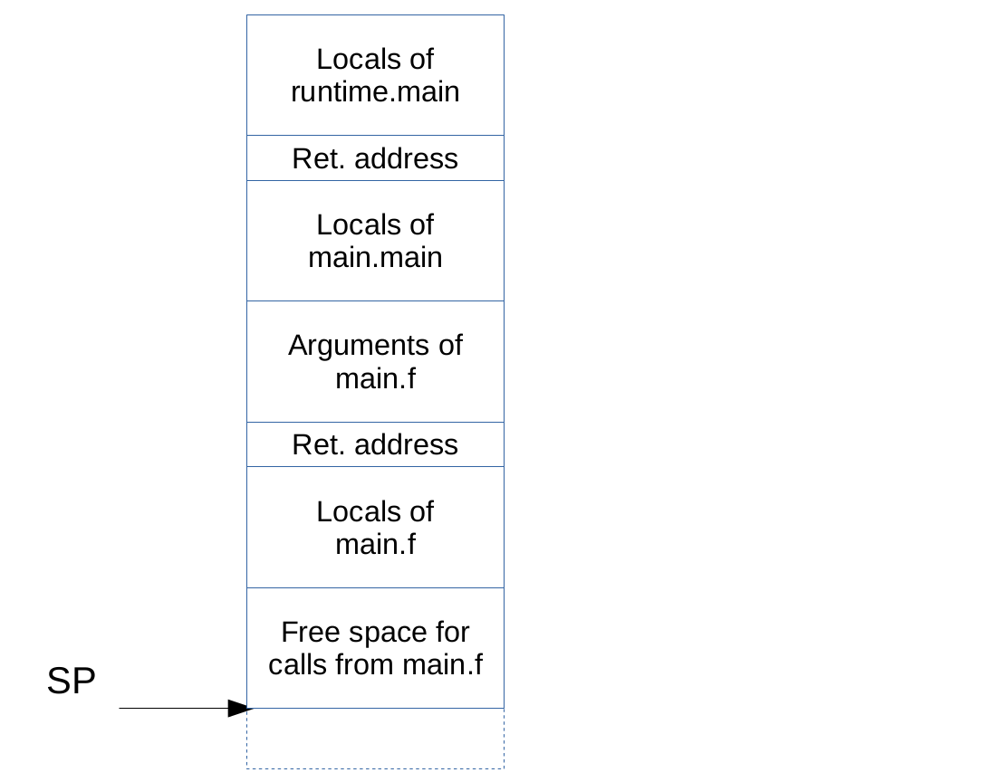

####################################################################################
# Call Injection in Delve, part 1: Introduction

This is the first part in a series of essays that will describe how function injection is implemented in Delve.

First a few definitions:
* with 'function call injection' I refer to the mechanism with which Delve enables the user to call a function in the target process, with the `call` command.
* with 'target process' I will refer to the process that's being debugged.
* with 'PC' I will refer to the *Program Counter* register of the CPU; this is the CPU register that contains the memory address of the next assembly instruction that will be executed by the CPU. On x86 this register is usually referred to with IP, or *Instruction Pointer*. I'm going to use PC instead to be consistent with the terminology used by the Go runtime
* with 'SP' I will refer to the 'Stack Pointer* register of the CPU; this is the CPU register that contains the address of the top  of the call stack, I will describe this in greater detail in a future part <!-- TODO figure out which -->

For reference the function call injection protocol was introduced in Go 1.11 with CL XXXX <!-- TODO: figure out which CL it was -->. Before this point it was impossible for any debugger to inject a call in a Go process, because of some complications in the Go runtime that will be discussed in a future part of this series <!-- TODO: figure out which -->.

Delve's side of the protocol was implemented for Linux in PR XXXX <!-- TODO: figure out which PR it was --> and extended to macOS in PR XXXX <!-- TODO: figure out which PR it was -->. The full implementation of function calls, as described in this essay was implemented with PR XXXX, XXXX and XXX <!-- TODO: none of these exists yet -->

## Background: the Continue loop

When a debugger wishes to debug a program it calls a special OS API and from that point on the OS will forward certain messages about the target process to the debugger.

At first approximation this *debugger events* include:

* Thread death and creation
* Process death
* Breakpoints

keeping this in mind the `continue` command of Delve is implemented as follows:

```

func Continue() {
	for {
		call ContinueOnce()
		
		evaluate condition of all breakpoints we hit
		return if a breakpoint has condition == true
	}
}

func ContinueOnce() {
	for {
		resume all threads of the target process
		wait for a debugger event from the OS
		switch {
		case thread creation or death:
			handle thread creation or death
		case breakpoint:
			stop all threads of the target process
			return
		default:
			forward anything else to the target process
		}
	}
}
```

Now, you may be wondering what the *forward anything else to the target process* thing is about. As it turns out when a program registers as the debugger for another process it won't just receive the debugger events I described above. The details of what *anything else* includes vary from operating system to operating system, but on Windows you will receive any [exception](https://docs.microsoft.com/en-us/windows/desktop/debug/structured-exception-handling) and on Unix-like OSes you will receive all [unix signals](https://en.wikipedia.org/wiki/Signal_(IPC)) destined for the target process.

Debuggers need to receive this because the might wish to do interesting things with them; it's fairly common, for example, for debuggers to handle SIGSEGV themselves. Delve, however, is a debugger for Go and we let the Go runtime handle SIGSEGV and any other exception or signal so we just forward everything.

The `Continue` function isn't just called to implement the `continue` command. Any command that resumes the execution of the target process, with the exception of `step-instruction`, is actually implemented by setting some breakpoints and then calling `Continue`. This includes `next`, `step` and `stepout`. At [Gophercon Iceland 2018](https://www.youtube.com/watch?v=IKnTr7Zms1k) I described in more detail how `next` is implemented.

I won't talk about `ContinueOnce` any more, its description was provided here only as background information and you can forget about it. I will talk a lot about Continue however: calling a function involves resuming the execution of the target process and therefore needs to go through Continue.

Since Continue is a loop I will refer to it henceforth as the *Continue loop*.

####################################################################################
# Call Injection in Delve, part 2: the call stack

The [call stack](https://en.wikipedia.org/wiki/Call_stack) (*stack* for short) is a data structure used by high level programming language to store the arguments, local variables and return address of each function call being currently executed. Details of its implementation vary depending on programming language and CPU architecture. In the following I'll focus on how the stack is implmeneted by Go on x86.

Go reserves a CPU register, which I'll call SP (for Stack Pointer), to point to the *topmost* element of the stack. Here topmost actually means *most recently inserted in the stack*. On all architectures supported by Go the stack grows downward in memory, what this means is that Go allocates a chunk of memory for the stack and initializes SP to point to the highest memory address in this chunk. When something needs to be pushed on the stack two things happen:

1. the SP register is decremented
2. the value we wish to push on the stack is written at SP

Conversely removing something from the stack is equivalent to incrementing the SP register.

Go never pushes or pops elements to the stack individually, instead on function entry it decrements the SP register enough to 'allocate' space for all its local variables plus all the arguments of the largest function call it can possibly make. This space is reclaimed just before the function returns, by incrementing the SP register.

For example if we consider this function:

```
func f() {
	var a, b, c int
	
	g(a)
	h(b, c)
}
```

on entry `f` will allocate space for its three local variables (8 bytes * 3) as well as space for the arguments to the largest function call it makes, which in this case is the call to `h` which requires two integer slots: 8 * 2; this means that `f` will need to decrement SP by 8*3 + 8*2 = 40 bytes.

A typical stack layout for Go will look like this:



Notes:
1. the return address is pushed automatically on the stack by the `CALL` assembly instruction, and removed automatically by the `RET` instruction.
2. Go also uses a frame pointer which needs to be tracked on the stack and isn't pictured here. Since it's not relevant to the topic of call injection I won't discuss it here.
3. Discussions of this topic typically include some definition of what a *stack* or *activation* frame is. I'll try to avoid this since, in my opinion, they mostly create confusion. 

## Call Injection with normal languages

In a "normal" programming language (for example: C) this is all you need to know to implement call injection. All you need to do is:

1. Push the arguments of the callee on the stack (i.e. decrement the SP register by the size, in bytes, of the callee arguments, and copy the value of the arguments in this space)
2. Push the address of a 'INT 3' instruction on the stack (executing the `INT 3` instruction is equivalent to hitting a breakpoint)
3. Save the current value of PC somewhere in the debugger memory and overwrite it with the entry point of the callee
4. Resume execution of the target process
5. When execution stops (because of the `INT 3` instruction at step (2)) read the return value, increment the SP register by the same value it was decremented at step (1) and restore the value of PC to the value it had before step (3).

This doesn't work for Go, for multiple reasons. Which we will explore in the next part <!-- TODO: link to next part -->

####################################################################################
# Call Injection in Delve, part 3: Go complications

Go is a [garbage collected](https://en.wikipedia.org/wiki/Garbage_collection_(computer_science)) language. This means that Go programmers don't have to worry about freeing memory, instead a garbage collector process will periodically go through all allocated memory, figure out which allocations are unreachable and free them for the user.

In order to do this the GC must be able to scan the stack of each goroutine and collect the value of all pointers that are allocated on the stack.

How this works, in practice, is that each Go binary contains a table, which we'll call *spdelta*, that associates to each program instruction the size of the stack frame at that instruction. 


The stack scan works like this:

1. get the current value of PC and SP for a Goroutine
2. read the return address, `ret`, at `sp + spdelta(pc)`
3. repeat the process with `pc = ret` and `sp = sp + spdelta(pc) + 8`

or in pseudocode:

```
func stackUnwind(pc, sp uintptr) []stackframe {
	var traceback []stackframe
	
	for {
		traceback = append(traceback, stackframe{ pc, sp })
		if isBottomFunction(pc) {
			return traceback
		}
		pc = *(*uintptr)(sp + spdelta(pc))
		sp = sp + spdelta(pc) + 8
	}
}
```

This stack scan isn't just used for GC, it's also used when resizing the stack by runtime.shrinkstack and runtime.morestack.

Now consider what will happen to this algorithm if we inject a call as described in the previous section:


The problem is that spdelta doesn't know about the extra space we allocated on the stack to hold the arguments of the injected function call, they break the chain of stack frames and it's impossible for the runtime to scan a stack like this.

Could we use the "free space" of `main.f` for the arguments of our injected call? The answer is *no*. 

1. It might not be big enough: it's just big enough to handle the largest call that main.f makes but main.f wasn't supposed to call the function that we injected. Also it could *already be in use*.
2. If main.f was in the process of making a different call when we injected our call the "free space" isn't actually free at all. 


####################################################################################
# Call Injection in Delve, part 4: debugCallV1

In a way the problem with injecting a function call boils down to the fact that we don't have space, anywhere on the stack, to write the function arguments. We can call functions that don't take arguments (and don't return anything). If we had a function that takes no arguments and allocates a bunch of free space on the stack for us we could make function calls.

And that's, in a nutshell, what runtime.debugCallV1 does. More in detail, after calling debugCallV1 (which we can easily do because it has no arguments and no return values):

1. debugCallV1 saves the CPU registers on the stack
2. checks that the goroutine is in a state where injecting a function call is safe
3. sets up a deferred function to catch and recover all panics
4. allocates an free stack frame large enough for the function call we want to inject
5. notifies to the debugger that the stack is ready to inject the call
6. when the injected call returns, or panics, notify the debugger of this fact

DebugCallV1 needs to communicate back to the debugger in multiple places: to notify the debugger that the call can't be injected, that the stack is ready and that the call finished or panicked. All this communication is done by setting the AX register to some value followed by triggering a software exception using the `INT 3` instruction.

Note: I have omitted some minor details from this description, see the implementation of runtime.debugCallV1 in $GOROOT/src/runtime/asm_amd64.s for a full description.

Now that we have this it's possible to implement function injection. This first implementation pass is more or less what was added to delve with PR <!-- TODO find out which one --> and has several flaws, which I will address later.

First we implement the `callOP` utility function:

```
func callOP(thread Thread, regs Registers, callAddr uint64) error {
	sp := regs.SP()
	// push PC on the stack
	sp -= PointerSize
	if err := thread.SetSP(sp); err != nil {
		return err
	}
	if err := writePointer(thread, sp, regs.PC()); err != nil {
		return err
	}
	// change PC to the new value
	return thread.SetPC(callAddr)
}
```

This is the debugger equivalent of a `CALL` instruction, it pushes the current value of PC on the stack and then changes PC to point to the entry point of whatever function we want to call (passed in as callAddr).

Now the function call injection can be initiated like this:

```
func CallFunction(expr *ast.CallExpr) error {
	fn := function associated with expr.Fun
	for _, arg := range expr.Args {
		evalute the arg expression and save it in debugger memory, write it to the 'argmem' byte buffer
	}
	
	regs := currentThread.Registers()
	
	save a copy of regs
	
	if err := callOP(currentThread, regs, entryPointOf("runtime.debugCallV1")); err != nil {
		return err
	}
	
	// write the size of the argument frame we need for our final injected call to the stack
	if err := writePointer(thread, regs.SP()-3*PointerSize, len(argmem)); err != nil {
		return err
	}
	
	return Continue()
}
```

This initiates the call injection protocol by calling runtime.debugCallV1 and then resuming the execution of the target process by calling Continue, which is the function we described in back in part 1.

The `INT 3` exception that debugCallV1 uses to communicate with the debugger look just like a breakpoint to the debugger (in fact, they are exactly the same as breakpoint). To respond to them the continue loop needs to be changed:

```
func Continue() {
	for {
		call ContinueOnce()
		
		switch the_current_function_of_the_current_thread {
		case "runtime.debugCallV1", "debugCall16", ...:
			funcCallStep()
			if call_injection_finished {
				return
			}
			continue
		}
		
		evaluate condition of all breakpoints we hit
		return if a breakpoint has condition == true
	}
}
```

This inserts the debugCallV1 protocol handling inside our normal continue loop so we can handle it in parallel to other normal debugger events (like, for example, concurrently hitting a user breakpoint).

All the protocol handling is done inside funcCallStep:

```
func funcCallStep() {
	regs := currentThread.Registers()
	
	switch regs.AX() {
	case debugCallAXPrecheckFailed:
		read error from the stack
		call_injection_finished = true
		
	case debugCallAXCompleteCall:
		copy argmem to the stack
		callOP(currentThread, regs, entryPointOfTargetFunction)
	
	case debugCallAXRestoreRegisters:
		restore the copy of registers we saved in CallFunction
		clean up call to runtime.debugCallV1
		call_injection_finished = true
		
	case debugCallAXReadReturn:
		read return values
		
	case debugCallAXReadPanic:
		read panic value
	}
}
```

This function reads a request in the AX register and responds accordingly.

This implementation of call injection has several limitation, some are intrinsic limitations of the Go runtime, but the most important ones aren't and can be worked around.

The first problem is that an expression like this `1 + h(2)` can not be evaluated like this. The root of the expression evaluated by `CallFunction` must be a function call (i.e. `*ast.CallExpr`) but in this case it's the binary operator `+`.

The second problem is that it doesn't handle nested function calls, such as `f(g())`. The reason this expression can not be evaluated like this, in general, is that g() could return a pointer to a heap allocated object. In this implementation the argument values are stored in the debugger's memory but the debugger memory is not visible to the GC of the target process, which means that between the point that `g()` returns and we have set up the call to `f(...)` the GC may not have any live reference to the object returned by `g()` and could collect it.

This could seem like a small problem, that users rarely want to inject nested calls from a debugger, but for example this expression:

```
fmt.Sprintf("%d", 2)
```

requires 4 call injections to be evaluated by a debugger:

1. one call to allocate the contents of the "%d" string
2. one call to allocate 2 to the heap so that it can be boxed into an interface{}
3. one call to allocate the backing array of the []interface{} slice used to represent the variable argument list of fmt.Sprintf
4. the call to fmt.Sprintf

####################################################################################
# Call Injection in Delve, part 5: evaluating expressions with embedded calls

<!-- TODO describe how to rearrange the code to allow evaluation of something like `1 + f() + g()` -->
<!-- TODO describe changes to support nested function calls -->

<!--
TODO:
- mention safepoints
- mention that everything restarts
- mention escape values
- spellcheck
-->